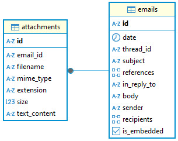
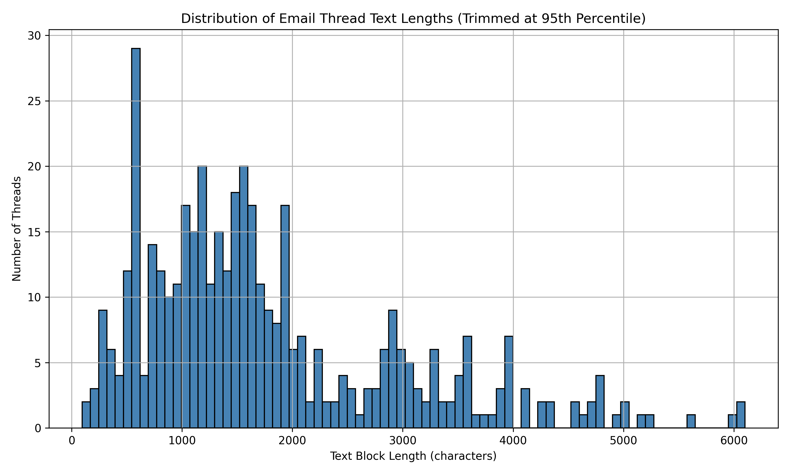

# RAG-Mail

RAG-Mail is a semantic search system built on top of the [RAG-Talk](https://github.com/ManiAm/RAG-Talk) project. It specializes in retrieving, embedding, and querying email threads, leveraging vector-based retrieval augmented generation (RAG) techniques. It is designed to preserve contextual flow across email conversations, enabling more accurate understanding, summarization, and intelligent question answering over email-based content. RAG-Mail supports ingesting emails from:

- Gmail API (with OAuth2-based read-only access)
- Unix MBOX files (standard format for local mail storage)

Both formats are parsed and normalized to a common internal structure that includes message metadata, body text, and attachment handling.

## System Architecture

### Email Attachment Integration

Attachments often contain critical context, and including their content improves the semantic richness of the final embeddings. RAG-Mail is designed to support a wide range of common email attachment types:

1. **Plain Text Formats**: Attachments such as `.txt`, `.log`, and `.csv` are directly read and included as plain text. These formats often contain structured logs, tabular data, or notes relevant to the conversation.

2. **Rich Document Formats**: Documents like `.pdf` and `.docx` are converted to plain text using appropriate parsers. This ensures the textual content is retained for embedding while ignoring layout and styling.

3. **Attached Emails** (`.eml`): When an email message is attached as a file, we parse it and extract critical fields, including sender, recipient(s), subject and message body. This enables nested email content to be indexed and understood contextually.

4. **Image Attachments**: Image formats like `.jpeg` and `.png` are processed using Optical Character Recognition (OCR). This is particularly useful for scanned documents, receipts, or handwritten notes, converting image content into searchable and embeddable text.

5. **Compressed Archives**: For `.zip` archives, the system unpacks the archive, and extracts text-based files (e.g., `.txt`, `.csv`, `.log`) for further processing. Non-text files are ignored.

### Attachment Type Detection

Accurate identification of attachment file types is critical for reliably extracting meaningful content and ensuring the correct parsing logic is applied. Rather than relying solely on file extensions - which can be misleading or manipulated - we use a multi-tiered MIME type inference strategy.

The preferred method for identifying attachment types is the `python-magic` library, which is a Python interface to the `libmagic` file type identification system (used by the Unix `file` command). It inspects the binary signature of the file (also called "magic numbers") to determine the actual MIME type. This is more reliable than using file extensions, especially for renamed or improperly labeled attachments.

If MIME detection via `python-magic` fails, the system follows a structured fallback sequence. If the email client provided a `Content-Type` header for the attachment, this value is used. If no MIME header is available, we use Python’s built-in `mimetypes.guess_type` as a last resort. This approach maps file extensions to their corresponding MIME types.

### Email Thread-Level Processing

Emails are grouped by `thread_id`, and each thread is processed as a single unit. This design decision is important for maintaining the conversational timeline and logical flow, especially in email chains involving replies, forwards, or follow-ups. All emails within a thread are chronologically sorted, combined into a single text block, and processed in one batch, rather than individually.

RAG-Mail uses a PostgreSQL relational database as a storage layer. This structured approach enables the system to go beyond transient embedding pipelines and establish a persistent and query-efficient record of all processed email data. Each parsed email is stored as a row in the `Email` table. Each attachment associated with an email is stored in the `Attachment` table, which is linked via a foreign key (`email_id`) to the parent `Email` row.

### Processing Pipeline

RAG-Mail is designed with two independent daemon threads, each responsible for a distinct part of the email processing pipeline. This separation allows for scalable, asynchronous operation, while maintaining data integrity through transactional database interactions.

- **Daemon Thread 1**: Email Fetching and Storage

    This thread is responsible for fetching new emails, parsing message content, metadata, and attachments, and storing email records in the PostgreSQL database (`Email` and `Attachment` tables). Every fetched message is timestamped and stored, making it easy to trace when and where it came from. Moreover, structured data storage can support external tools for monitoring, dashboards, and audits.

- **Daemon Thread 2**: Embedding Pending Threads

    This thread queries the database for emails that have not yet been embedded yet. It groups them based on email `thread_id` and constructs a full document representing the chronological flow of all emails in the thread, including attachment content. It then sends the combined document to the RAG-Talk service for chunking and embedding (more on this later). It finally updates the DB to mark all emails of the thread as embedded.

### Chunking

The `RecursiveCharacterTextSplitter` from LangChain is a utility designed to break large text documents into smaller, semantically meaningful chunks based on a hierarchy of configurable separators. By default, it attempts to split on paragraph breaks, then sentences, and finally words or characters, ensuring that chunks are as long as possible without exceeding a specified size. In this project, we use the same utility to divide email threads into chunks suitable for embedding and retrieval.

However, because email threads often include structured markers, quoted replies, or inline attachments, we override the default separators with a custom list tailored to email formatting. This allows us to prioritize splitting along email boundaries, attachment sections, and reply headers, rather than arbitrary sentences or paragraphs. This strategy results in cleaner, self-contained chunks that preserve the context of individual messages within a thread - improving semantic coherence and the quality of downstream retrieval.

### Embedding

We use the `bge-large-en-v1.5` embedding model because it provides high-quality semantic representations while supporting a context window of up to 512 tokens. To stay within this limit and avoid truncation, the combined thread content (including attachments) is split using a chunk size of `1,800` characters - an approximate upper bound for 512 tokens in typical English text. This strategy ensures each chunk maintains coherent meaning while remaining compatible with the model’s constraints. Each chunk is then embedded and stored in the Qdrant vector database through a backend API exposed by the RAG-Talk system.

| Model Name           | Model Type | Vector Size | Max Tokens | Max Characters |
|----------------------|------------|-------------|------------|----------------|
| all-MiniLM-L6-v2     | MiniLM     | 384         | 512        | ~1,800         |
| all-MiniLM-L12-v2    | MiniLM     | 384         | 512        | ~1,800         |
| bge-base-en-v1.5     | BERT       | 768         | 512        | ~1,800         |
| bge-large-en-v1.5    | BERT       | 1024        | 512        | ~1,800         |
| mxbai-embed-large    | BERT       | 1024        | 512        | ~1,800         |
| e5-base-v2           | BERT       | 768         | 512        | ~1,800         |
| e5-large-v2          | BERT       | 1024        | 512        | ~1,800         |
| bge-m3               | BERT       | 1024        | 8192       | ~28,500        |
| nomic-embed-text     | Custom     | 768         | 8192       | ~28,500        |

The `bge-m3` embedding model is part of the latest generation of multilingual BERT-based models, offering a massive context window of up to 8,192 tokens, which translates to approximately 28,500 characters of input. This extended window allows it to embed long email threads in a single pass, reducing the need for chunking and preserving more global context. However it has larger model size, higher memory and compute requirements, and longer inference times, which are less optimal for lightweight or edge deployments.

### Email Thread Size Distribution and Embedding Strategy

Based on an analysis of my email thread corpus, I observed a wide range of content lengths. The median thread length is 1,538 characters, indicating that at least half of the threads are relatively short and can fit within a single chunk. The mean length is 3,236 characters, while the 95th percentile reaches 6,101 characters, and a few outliers exceed 400,000 characters. This distribution highlights that while most threads are compact, a minority can grow substantially longer, especially when containing repeated or verbose content.

If you're working with your own email data, you can use the provided [plot_thread_length_distribution.py](./plot_thread_length_distribution.py) script to extract `text_block_len` values, visualize their distribution, and inform your own decisions around embedding models and chunk sizes.

### Summarization

Embedding large email threads directly can result in excessive chunking, leading to storage inefficiencies, redundant semantic vectors, and diluted context during retrieval. In these cases, blindly chunking the entire content may not only be computationally expensive but also introduce noise that reduces retrieval quality. To address this, we use a conditional strategy: if a thread's chunk count exceeds a predefined threshold, we apply summarization prior to embedding. Summarization compresses the key intent and topics of the thread into a compact form that fits within a single embedding-friendly chunk.

### Document Metadata

Each embedded document is accompanied by structured metadata, such as `thread_id`, subject, attachment_count, etc. This metadata allows for advanced filtering, faceted search, and ranking during retrieval. It also aids in building analytics or audit trails. For example, you can use a filter query in Qdrant to retrieve all vector embeddings associated with a specific thread by filtering on the `thread_id` metadata field.

    {
        "limit": 100,
        "filter": {
            "must": [
                {
                    "key": "metadata.thread_id",
                    "match": {
                        "value": "19726dd140314d4d"
                    }
                }
            ]
        }
    }

When a new email arrives in an existing thread, all previously embedded chunks for that thread are removed from the vector database. The updated thread, including the new email and all prior ones, is reconstructed and re-embedded. This ensures that the thread remains consistent and up to date for future semantic queries. This design prioritizes embedding consistency over performance in cases of thread updates, which is appropriate for maintaining retrieval quality in long-lived conversations.

## Getting Started

Start the PostgreSQL Docker container:

    docker compose up -d

Update [config.py](config.py) to reflect URL for the running RAG-Talk.

If you're processing emails from a local `.mbox` file, use the following command:

    python3 main.py --source mbox --mailbox /path/to/mbox

If you want to fetch emails directly from your Gmail account via OAuth, run:

    python3 main.py --source gmail

Follow steps in [here](#setting-up-gmail-api-oauth-20-credentials) to enable Gmail access and obtain OAuth 2.0 credentials for use with this project. `credentials.json` file contains your OAuth 2.0 Client ID and Client Secret from Google Cloud. On the very first run, no valid token is found, and the project displays the following message:

    Please visit this URL to authorize this application: <url>

Open the URL in your browser, choose your Gmail account, and approve the requested scopes. After approval, we receive a valid access token. We serialize the token and save it under `token.pickle`. Next time you run the project, the token is loaded and login is skipped.

## Download Gmail Emails

Use Google takeout to download a copy of your emails.

- Go to https://takeout.google.com
- Select only "Mail"
- Export and download the archive
- The downloaded archive will contain a `.mbox` file for your Gmail.

MBOX is a standard file format used for storing collections of email messages in a single text file. Each email in an MBOX file is appended one after another, typically starting with a `From` line that marks the beginning of a new message. Originally developed for Unix-based systems, MBOX is widely supported by email clients and tools for archiving or transferring emails. It's particularly useful for backing up email inboxes or processing large batches of messages in offline or automated environments.

## Setting Up Gmail API OAuth 2.0 Credentials

Google APIs use OAuth 2.0 for user authorization. RAG-Mail should:

- Authenticate the user
- Request read-only scopes
- Get a token representing the user's consent

Go to Gmail API page, and click Enable.

Go to "OAuth Consent Screen" and configure it.

- App name (e.g., "My Gmail Reader")
- User support email (your email)
- Choose External (if you're using a regular Google account)
- Fill in contact information
- Click on "Create"

Next:

- Click on "Create OAuth client"
- Set "Application type" to "Desktop app", and give it a name.
- Click on "Create"
- Click on "Download JSON"
- Save it in the RAG-Mail project root folder under "credentials.json"

Go to "OAuth Consent Screen" again.

- Click on Audience
- Under Test users, click on "Add users"
- Add your Gmail address

## Sample Interaction

I run RAG-Mail on my personal Gmail account, processing the latest 1,000 emails. Through the RAG-Talk web interface, I can interact with the indexed content and ask context-aware questions across my latest email history.

